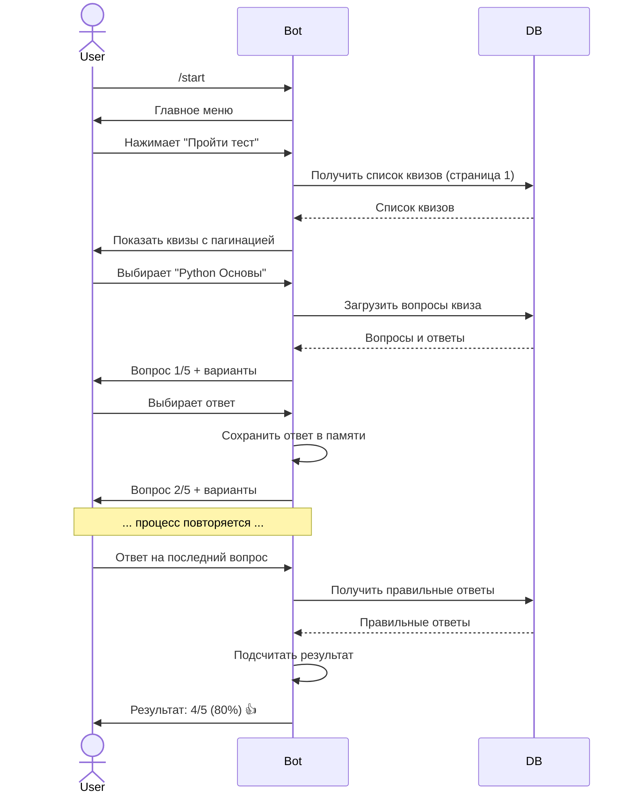
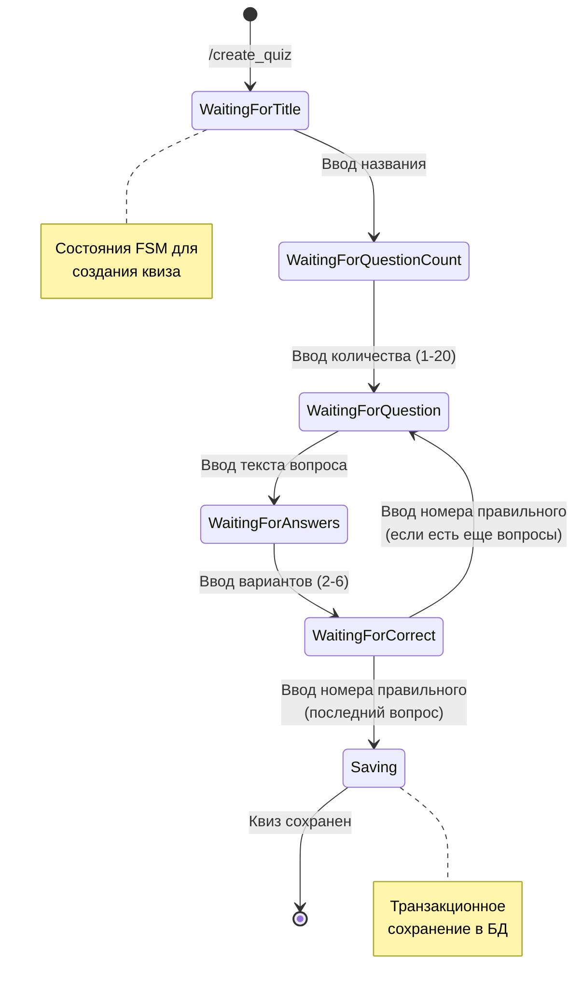
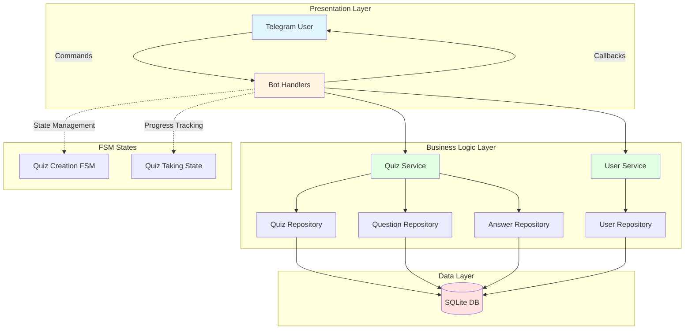
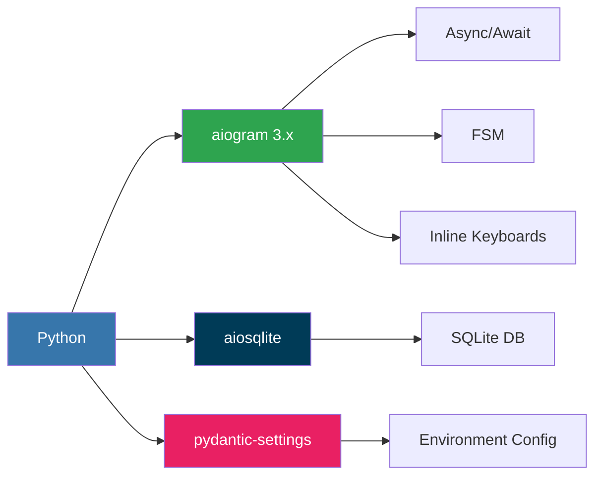

# Telegram Quiz Bot

В рамках проекта был разработан Telegram-бот для создания и прохождения образовательных тестов по программированию. Проект реализован с использованием современных технологий и архитектурных паттернов, включая асинхронное программирование, многослойную архитектуру и принципы SOLID.

Бот предоставляет пользователям возможность проходить готовые тесты по различным темам программирования, а также создавать собственные тесты через интерактивный интерфейс. Система автоматически подсчитывает результаты и предоставляет детальную статистику прохождения.

## Цели и задачи практики

### Цель
Разработать полнофункциональное веб-приложение в виде Telegram-бота для образовательных целей с применением современных технологий разработки.

### Задачи
1. Изучить документацию Telegram Bot API и библиотеки aiogram
2. Спроектировать архитектуру приложения с использованием паттернов проектирования
3. Разработать базу данных для хранения пользователей, тестов и результатов
4. Реализовать функционал прохождения тестов с навигацией
5. Реализовать функционал создания тестов через интерактивный интерфейс
6. Внедрить систему логирования и обработки ошибок
7. Провести тестирование и отладку приложения
8. Подготовить документацию проекта

## Функциональные возможности

### Для пользователей
- 📝 Прохождение тестов по программированию (15 готовых тестов)
- ➕ Создание собственных тестов через интерактивный интерфейс
- 📊 Получение детальных результатов с процентами и оценкой
- 🔄 Навигация по вопросам (вперед/назад)
- 📄 Пагинация списка тестов (по 6 на страницу)
- 💾 Автоматическое сохранение прогресса прохождения

### Технические возможности
- Асинхронная обработка запросов
- Валидация пользовательского ввода
- Защита от SQL-инъекций
- Структурированное логирование
- Обработка ошибок без потери данных

## Используемые технологии

### Язык программирования
- **Python** - современная версия с поддержкой type hints и async/await

### Основные библиотеки
- **aiogram 3.x** - асинхронный фреймворк для Telegram Bot API
- **aiosqlite** - асинхронная работа с SQLite базой данных
- **pydantic-settings** - управление конфигурацией и валидация
- **python-dotenv** - работа с переменными окружения

### Инструменты разработки
- **uv** - современный менеджер пакетов Python
- **Git** - система контроля версий
- **SQLite** - встроенная реляционная база данных

## Архитектура приложения

### Архитектурный паттерн
Проект реализован с использованием **многослойной архитектуры** (Layered Architecture):

```
┌─────────────────────────────────────┐
│   Presentation Layer (Handlers)     │  ← Обработка команд и callback'ов
├─────────────────────────────────────┤
│   Business Logic Layer (Services)   │  ← Бизнес-логика и валидация
├─────────────────────────────────────┤
│   Data Access Layer (Repositories)  │  ← Работа с базой данных
├─────────────────────────────────────┤
│   Database Layer (SQLite)           │  ← Хранение данных
# Установка uv (если еще не установлен)
└─────────────────────────────────────┘
```

### Применяемые принципы и паттерны

#### SOLID принципы
- **Single Responsibility** - каждый класс отвечает за одну задачу
- **Open/Closed** - код открыт для расширения, закрыт для модификации
- **Dependency Inversion** - зависимость от абстракций, а не реализаций

#### Паттерны проектирования
- **Repository Pattern** - абстракция доступа к данным
- **Service Layer** - инкапсуляция бизнес-логики
- **Dependency Injection** - внедрение зависимостей
- **FSM (Finite State Machine)** - управление состояниями диалога

### Структура базы данных

```sql
users
├── id (INTEGER PRIMARY KEY)
├── telegram_id (INTEGER UNIQUE)
├── username (TEXT)
├── first_name (TEXT)
└── created_at (TIMESTAMP)

quizzes
├── id (INTEGER PRIMARY KEY)
├── title (TEXT)
├── creator_id (INTEGER FK → users.id)
└── created_at (TIMESTAMP)

questions
├── id (INTEGER PRIMARY KEY)
├── quiz_id (INTEGER FK → quizzes.id)
├── text (TEXT)
├── position (INTEGER)
└── correct_answer (INTEGER)

answers
├── id (INTEGER PRIMARY KEY)
├── question_id (INTEGER FK → questions.id)
├── text (TEXT)
└── position (INTEGER)
```

## Установка и настройка

### 1. Клонирование репозитория

```bash
git clone https://github.com/sqdnosita/telegramQuizBot.git
cd telegram-quiz-bot
```

### 2. Установка менеджера пакетов uv

```bash
# macOS/Linux
curl -LsSf https://astral.sh/uv/install.sh | sh

# Windows (PowerShell)
powershell -c "irm https://astral.sh/uv/install.ps1 | iex"
```

### 3. Установка зависимостей

```bash
uv sync
```

### 4. Настройка переменных окружения

Создайте файл `.env` на основе `.env.example`:

```bash
cp .env.example .env
```

Отредактируйте `.env` и добавьте токен бота:

```env
BOT_TOKEN=your_telegram_bot_token_here
DATABASE_PATH=quiz_bot.db
```

**Получение токена:**
1. Откройте [@BotFather](https://t.me/BotFather) в Telegram
2. Отправьте команду `/newbot`
3. Следуйте инструкциям для создания бота
4. Скопируйте полученный токен в `.env`
## Запуск приложения

### Инициализация базы данных

При первом запуске или для сброса данных:

```bash
uv run reset_db.py
```

Эта команда:
- Удаляет существующую базу данных (если есть)
- Создает новую базу с актуальной схемой
- Применяет все необходимые индексы и ограничения

### Наполнение тестовыми данными

Для демонстрации функционала загрузите готовые тесты:

```bash
uv run seed_data.py
```

Будет создано **15 образовательных тестов** по темам:
1. Python Основы (5 вопросов)
2. JavaScript Основы (4 вопроса)
3. SQL Запросы (6 вопросов)
4. HTML & CSS (4 вопроса)
5. Git Основы (4 вопроса)
6. Docker Основы (4 вопроса)
7. Linux Команды (4 вопроса)
8. REST API (4 вопроса)
9. Базы данных (4 вопроса)
10. Алгоритмы (4 вопроса)
11. Тестирование (4 вопроса)
12. Сети (4 вопроса)
13. Безопасность (4 вопроса)
14. Паттерны проектирования (4 вопроса)
15. Agile & Scrum (4 вопроса)

### Запуск бота

```bash
uv run main.py
```

После запуска в консоли появится сообщение:
```
Bot started successfully
Press Ctrl+C to stop
```

Бот готов к работе! Найдите его в Telegram по имени, указанному при создании.

## Руководство пользователя

### Доступные команды

| Команда | Описание |
|---------|----------|
| `/start` | Запустить бота и показать главное меню |
| `/help` | Показать справку по использованию |
| `/create_quiz` | Создать новый тест |
| `/cancel` | Отменить текущее действие |

### Прохождение тестов

**Пошаговая инструкция:**

1. **Выбор теста**
   - Нажмите кнопку "📝 Пройти тест" в главном меню
   - Используйте кнопки навигации (⬅️ Назад / Вперёд ➡️) для просмотра страниц
   - Выберите интересующий тест из списка

2. **Ответы на вопросы**
   - Читайте вопрос и варианты ответов
   - Нажмите на кнопку с выбранным ответом
   - Используйте "⬅️ Назад" для возврата к предыдущему вопросу
   - Прогресс отображается в формате "Вопрос X из Y"

3. **Получение результатов**
   - После ответа на все вопросы нажмите "✅ Завершить квиз"
   - Система покажет:
     - Количество правильных ответов
     - Процент правильных ответов
     - Оценку результата (🏆 Отлично / 👍 Хорошо / 📚 Неплохо / 💪 Попробуйте еще раз)

### Создание собственных тестов

**Пошаговая инструкция:**

1. **Начало создания**
   - Нажмите "➕ Создать тест" или отправьте `/create_quiz`
   - Введите название теста (например: "Python для начинающих")

2. **Указание количества вопросов**
   - Введите число от 1 до 20
   - Рекомендуется: 4-10 вопросов для оптимального времени прохождения

3. **Добавление вопросов**
   
   Для каждого вопроса:
   
   a) **Текст вопроса**
   ```
   Какой метод используется для добавления элемента в список?
   ```
   
   b) **Варианты ответов** (каждый на новой строке)
   ```
   add()
   append()
   push()
   insert()
   ```
   Минимум 2, максимум 6 вариантов
   
   c) **Номер правильного ответа**
   ```
   2
   ```
   (нумерация начинается с 1)

4. **Завершение**
   - После добавления всех вопросов тест автоматически сохраняется
   - Тест сразу становится доступен для прохождения

**Отмена создания:**
- Отправьте `/cancel` на любом этапе для отмены

## Процесс разработки

### День 1: Постановка задачи и проектирование

#### 1. Выбор и уточнение темы

**Тема:** Телеграм-бот для создания и прохождения квизов (тестов) для программистов

**Предметная область:** EdTech, HR, Dev Communities

**Проблема:** 
Программисты хотят быстро проверять знания (свои или коллег) в привычной среде (Telegram). Создание тестов должно быть таким же простым, как написание сообщения.

**Целевая аудитория:**
1. Разработчики - для самопроверки знаний
2. Тимлиды / HR - для создания тестов для команды/кандидатов
3. Преподаватели - для проверки знаний студентов

**Ограничения:**
- Только текстовые вопросы и варианты ответов (без картинок на MVP)
- Интерфейс ограничен возможностями Telegram (кнопки, команды)
- Стек: Python, aiogram 3.x, aiosqlite

#### 2. Цель, задачи и метрики

**Цель:** 
Разработать асинхронного Telegram-бота на aiogram, который позволяет пользователям проходить тесты, а также создавать и управлять собственными тестами через FSM (Finite State Machine).

**Задачи:**

1. **Ядро бота**
   - Настроить базовую инфраструктуру aiogram (Dispatcher, Bot)
   - Реализовать конфигурацию через .env
   - Настроить систему логирования

2. **Сценарий "Прохождение теста"**
   - Реализовать навигацию по вопросам (Inline-кнопки)
   - Реализовать сбор ответов пользователя
   - Реализовать подсчет и отображение результата
   - Добавить возможность возврата к предыдущему вопросу

3. **Сценарий "Создание теста"**
   - Реализовать FSM-сценарий для создания квиза
   - Пошаговый ввод: название, вопросы, варианты ответов
   - Валидация пользовательского ввода
   - Сохранение в базу данных

4. **База данных**
   - Спроектировать схему БД (users, quizzes, questions, answers)
   - Подключить aiosqlite для асинхронной работы
   - Реализовать репозитории для каждой сущности
   - Обеспечить целостность данных через Foreign Keys

5. **Интерфейс**
   - Разработать главное меню (команды /start, /help)
   - Создать навигационные кнопки (Inline Keyboards)
   - Реализовать пагинацию списка тестов
   - Обеспечить понятную обратную связь

**Критерии готовности (Definition of Done):**
- ✅ Пользователь может запустить бота (/start)
- ✅ Пользователь может выбрать "Пройти тест" и дойти до результатов
- ✅ Пользователь может создать новый квиз через /create_quiz
- ✅ Созданный квиз доступен для прохождения другим пользователям
- ✅ Реализована навигация вперед/назад по вопросам
- ✅ Реализована пагинация списка тестов (по 6 на страницу)

**Метрики успеха:**
- Корректный подсчет результатов (100% совпадение)
- Время ответа бота на нажатие кнопки < 1 секунды
- FSM-сценарий создания квиза завершается успешно в 95% случаев
- Отсутствие "застревания" в состояниях FSM

#### 3. Стейкхолдеры и сценарии использования

**Стейкхолдеры:**
- Руководитель практики / Ментор
- Пользователи (Программисты, HR, Преподаватели)

**Пользовательские роли:**
1. **User (Пользователь)** - может проходить существующие квизы
2. **Creator (Создатель)** - может создавать новые квизы (любой User может стать Creator)

**Ключевые сценарии (Use Cases):**

##### UC-1: Прохождение квиза



##### UC-2: Создание квиза



**Детальный сценарий создания:**

1. User нажимает "Создать квиз" → FSM: `WaitingForTitle`
2. Bot: "Введите название вашего квиза"
3. User: "Тест по Git" → FSM: `WaitingForQuestionCount`
4. Bot: "Сколько вопросов будет в тесте? (1-20)"
5. User: "3" → FSM: `WaitingForQuestion`
6. Bot: "Введите текст вопроса 1/3"
7. User: "Какой командой создается ветка?" → FSM: `WaitingForAnswers`
8. Bot: "Введите варианты ответа (каждый на новой строке, от 2 до 6)"
9. User вводит:
   ```
   git branch
   git new
   git commit
   git checkout
   ```
   → FSM: `WaitingForCorrect`
10. Bot: "Введите номер правильного ответа (1-4)"
11. User: "1" → FSM: `WaitingForQuestion` (вопрос 2/3)
12. ... процесс повторяется для всех вопросов ...
13. После последнего вопроса → FSM: `Saving`
14. Bot сохраняет квиз в БД транзакционно
15. Bot: "✅ Квиз 'Тест по Git' успешно создан!"
16. FSM завершается → [*]

#### 4. Блок-схема архитектуры



#### 5. Технологический стек



### Этапы реализации

**Этап 1: Инфраструктура** ✅
- Настройка проекта (uv, pyproject.toml)
- Конфигурация (.env, config.py)
- Система логирования
- Базовая структура бота

**Этап 2: База данных** ✅
- Проектирование схемы
- Создание таблиц с индексами
- Реализация репозиториев
- Тестирование целостности данных

**Этап 3: Прохождение тестов** ✅
- Обработчики для выбора теста
- Навигация по вопросам
- Сохранение ответов в памяти
- Подсчет и отображение результатов
- Пагинация списка тестов

**Этап 4: Создание тестов** ✅
- FSM для создания квиза
- Валидация пользовательского ввода
- Транзакционное сохранение
- Обработка ошибок и отмены

**Этап 5: Тестирование и документация** ✅
- Наполнение тестовыми данными (15 квизов)
- Тестирование всех сценариев
- Написание документации
- Подготовка отчета по практике

## Структура проекта

```
telegram-quiz-bot/
├── .kiro/                         # Конфигурация IDE
│   └── specs/                     # Спецификации проекта
│       └── telegram-quiz-bot/
│           ├── requirements.md    # Требования (EARS формат)
│           ├── design.md          # Проектная документация
│           └── tasks.md           # План реализации
├── bot/                           # Основной пакет приложения
│   ├── database/                  # Слой работы с базой данных
│   │   ├── __init__.py
│   │   ├── connection.py          # Менеджер подключений (Context Manager)
│   │   └── schema.py              # Схема БД и миграции
│   ├── handlers/                  # Обработчики событий (Presentation Layer)
│   │   ├── __init__.py
│   │   ├── start_handler.py       # Команды /start и /help
│   │   ├── quiz_handler.py        # Прохождение тестов + пагинация
│   │   └── create_handler.py      # Создание тестов (FSM)
│   ├── keyboards/                 # Интерфейсы (Inline Keyboards)
│   │   ├── __init__.py
│   │   ├── main_menu.py           # Главное меню
│   │   ├── quiz_list.py           # Список тестов с пагинацией
│   │   └── question_keyboard.py   # Варианты ответов
│   ├── middlewares/               # Промежуточные обработчики
│   │   ├── __init__.py
│   │   └── logging_middleware.py  # Логирование запросов
│   ├── repositories/              # Репозитории (Data Access Layer)
│   │   ├── __init__.py
│   │   ├── user_repository.py     # CRUD для пользователей
│   │   ├── quiz_repository.py     # CRUD для квизов + пагинация
│   │   ├── question_repository.py # CRUD для вопросов
│   │   └── answer_repository.py   # CRUD для ответов
│   ├── services/                  # Бизнес-логика (Business Logic Layer)
│   │   ├── __init__.py
│   │   ├── user_service.py        # Логика работы с пользователями
│   │   └── quiz_service.py        # Логика квизов (создание, подсчет)
│   ├── states/                    # FSM состояния
│   │   ├── __init__.py
│   │   └── quiz_states.py         # Состояния для создания квиза
│   ├── __init__.py
│   ├── config.py                  # Конфигурация (pydantic-settings)
│   └── logger.py                  # Настройка логирования
├── logs/                          # Логи приложения
│   └── bot.log                    # Основной лог-файл
├── .env                           # Переменные окружения (не в git)
├── .env.example                   # Пример конфигурации
├── .gitignore                     # Исключения для git
├── .python-version                # Версия Python для проекта
├── main.py                        # Точка входа приложения
├── seed_data.py                   # Скрипт наполнения тестовыми данными
├── reset_db.py                    # Скрипт пересоздания БД
├── pyproject.toml                 # Зависимости проекта (uv)
├── README.md                      # Документация проекта
├── TESTING.md                     # Руководство по тестированию
└── quiz_bot.db                    # SQLite база данных (создается автоматически)
```

### Описание ключевых модулей

#### Handlers (Обработчики)
- **start_handler.py** - обработка команд `/start` и `/help`, отображение главного меню
- **quiz_handler.py** - полный цикл прохождения теста: выбор, навигация, подсчет результатов
- **create_handler.py** - FSM-сценарий создания теста с валидацией ввода

#### Services (Сервисы)
- **user_service.py** - регистрация пользователей, получение информации
- **quiz_service.py** - создание квизов, загрузка с вопросами, подсчет результатов, пагинация

#### Repositories (Репозитории)
- **user_repository.py** - работа с таблицей users
- **quiz_repository.py** - работа с таблицей quizzes, пагинация
- **question_repository.py** - работа с таблицей questions
- **answer_repository.py** - работа с таблицей answers

#### Database (База данных)
- **connection.py** - Context Manager для безопасной работы с БД
- **schema.py** - SQL-схема, создание таблиц, индексов, Foreign Keys

## Разработка

### Логирование

Логи сохраняются в директории `logs/`:
- `bot.log` - основной лог файл

Уровень логирования можно изменить в `bot/logger.py`.

### База данных

SQLite база данных создается автоматически при первом запуске.
Файл БД: `quiz_bot.db` (указан в `.env`)

Схема БД:
- `users` - пользователи
- `quizzes` - квизы
- `questions` - вопросы
- `answers` - варианты ответов

## Безопасность

Проект разработан с учетом современных требований безопасности:

### Защита данных
- ✅ Токен бота хранится только в `.env` (не коммитится в git)
- ✅ Все пользовательские вводы валидируются перед обработкой
- ✅ Используются параметризованные SQL-запросы (защита от SQL-инъекций)
- ✅ Foreign key constraints для целостности данных
- ✅ Логирование без чувствительных данных

### Валидация входных данных
- Проверка длины названия квиза (1-100 символов)
- Проверка количества вопросов (1-20)
- Проверка количества вариантов ответов (2-6)
- Проверка номера правильного ответа (в пределах количества вариантов)
- Проверка типов данных (int, str)

### Обработка ошибок
- Graceful degradation при ошибках БД
- Информативные сообщения пользователю без раскрытия внутренней логики
- Логирование всех исключений для отладки
- Возможность отмены операции через `/cancel`

## Результаты проекта

### Достигнутые результаты

**Функциональные требования:**
- ✅ Реализован полнофункциональный Telegram-бот
- ✅ Пользователи могут проходить тесты с навигацией
- ✅ Пользователи могут создавать собственные тесты
- ✅ Реализована пагинация списка тестов (по 6 на страницу)
- ✅ Подготовлено 15 готовых тестов по различным темам
- ✅ Корректный подсчет результатов с процентами

**Технические требования:**
- ✅ Асинхронная архитектура на базе aiogram 3.x
- ✅ Многослойная архитектура (Handlers → Services → Repositories → DB)
- ✅ FSM для управления состояниями создания теста
- ✅ Транзакционное сохранение данных
- ✅ Система логирования
- ✅ Обработка ошибок

**Качество кода:**
- ✅ Соблюдение PEP 8
- ✅ Type hints для всех функций
- ✅ Docstrings для публичных методов
- ✅ Принципы SOLID
- ✅ Паттерны проектирования (Repository, Service Layer, FSM)

## Заключение

В ходе реализации проекта был успешно разработан полнофункциональный Telegram-бот для создания и прохождения образовательных тестов. Проект демонстрирует применение современных технологий и лучших практик разработки программного обеспечения.

Все поставленные цели и задачи практики были достигнуты. Приложение готово к использованию и может быть развернуто в production-окружении после минимальных доработок (переход на PostgreSQL, добавление мониторинга).

## Лицензия

MIT License - проект может быть свободно использован в образовательных и коммерческих целях.
